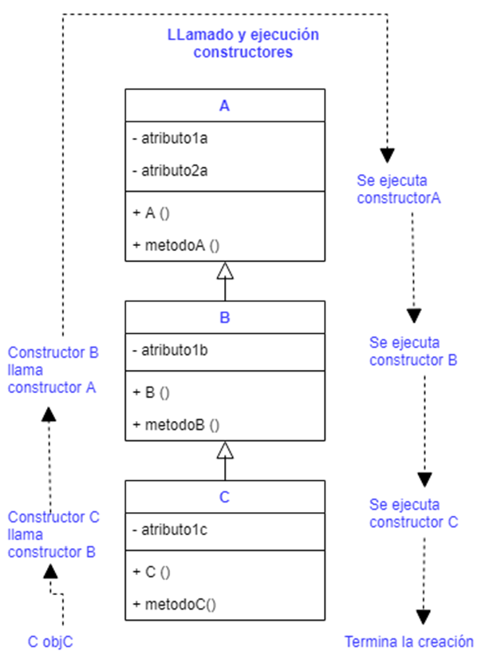
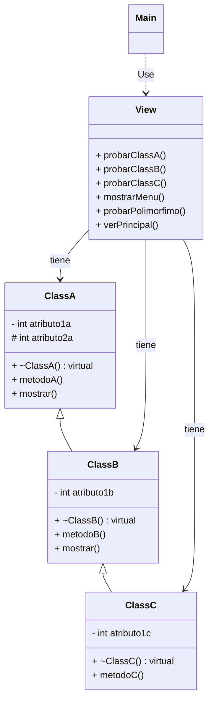

# Instalación
Luego de clonar este proyecto....

## Visual studio code
* En Visual Studio Code escriba `ctr + shift + p` y escriba en la ventana que abre Cmake:Configure [ Debe tener instalado antes el plugin para C++, el plugin de CMAKE e instalados y configurados en su computador el compilador de C++, Make, y CMAKE]
* En las opciones que aparecen seleccione `default`

## CLion
 Abrir el proyecto existente:
1. **Abre CLion**.

2. **Selecciona "Open"** en la ventana principal o ve a `File ‚Üí Open`.

3. **Navega hasta la carpeta donde tienes el proyecto** (o el archivo `.cpp`).

4. **Selecciona la carpeta del proyecto** (no solo el archivo).

> 📄 **Nota**: CLion buscará automáticamente un `CMakeLists.txt` en esa carpeta para configurar el proyecto.  

### 3. Permitir que CLion configure el proyecto

Apenas abras el proyecto, CLion detectará automáticamente el archivo `CMakeLists.txt` y te preguntará si quieres cargar la configuración.

Haz clic en **"Yes"** para permitirlo.

---

### 4. Verificar la configuración del entorno

Ve a `File ‚Üí Settings ‚Üí Build, Execution, Deployment ‚Üí Toolchains`.

Aseg√∫rate de que:

- El compilador de C++ esté correctamente detectado.
- CMake esté correctamente configurado.


# Ejercicios

1. Agrege la implementación a los métodos `probarClassA` `probarClassB` y `probarClassC` en donde llame los métodos y variables a los que tiene acceso de cada clase. El esqueleto de estos métodos se encuentra en el archivo View.cpp
2. Observe que constructores invoca en la ejecución de cada método
3. Trate de acceder desde la `ClassC``a los atributos privados, y protegidos de la `ClassA`   
4. Pruebe el método `probarPolimorfismo` tal como se encuentra el código actualmente
5. Pruebe el método `probarPolimorfismo` comentando la línea 20 de la `ClassA` y descomentando la línea 21
6. Agregue el método `mostrar` a la clase `C`


## Algunas respuestas
### Ejemplos de códigos de prueba
```c++

    void View::probarClassA()
    {
        // Cree un apuntador de ClassA y llame los métodos propios de la clase
        
        ClassA * miObjClassA = new ClassA();
        miObjClassA->mostrar();
        
        // Trato de llamar al metodoB, no se puede pq es un metodo de la subclase
        //miObjClassA->mostrarB(); Por eso no aparece.
    
    }


    void View::probarClassB()
    {
        // Cree un apuntador de ClassB y llame los métodos propios de la clase

        ClassB * miObjClassB = new ClassB();
        cout << "LLamo a un metodo sobreescrito \n";
        miObjClassB->mostrar();
    
        cout << "LLamo a atributo protegido \n";
        // miObjClassB->atributo2a;  // No se puede pq solo lo podría ver dentro de la clase.

    }

    void View::probarClassC()
    {
        // Cree un apuntador de ClassC y llame los métodos propios de la clase. Observe que puede acceder a métodos definidos en ClassA y en ClassB
        ClassC * miObjClassC = new ClassC();
        cout << "LLamo al metodo especifico \n";
        miObjClassC->metodoC();
    
        cout << "LLamo a metodos heredados especifico de la clase A \n";
        miObjClassC->metodoA();
    
        cout << "LLamo a metodo mostrar que heredo. Llamara al de A o al de B? \n";
        miObjClassC->mostrar();
    }


```


### Respuestas téóricas
* **En cuanto a constructores:** Note que aunque la llamada al constructor de la clase padre no sea explícita en la construcción del objeto siempre se llaman los constructores de las clases padres antes de invocar el constructor de la clase que se está creando
* **Atributos protegidos:** Note que desde `View.cpp` no puede acceder a ningún atributo protegido. Esto es pq para acceder a atributos protegidos solo puede hacerlo desde la clase que hereda el atributo protegido. Para este caso serían las clases `ClassA` y `ClassB`
* **Herencia:** Note que la `ClassC` es la clase que tiene acceso a más métodos, pues es la clase que hereda tanto de `ClassA` como de `ClassB`
* **Polimorfismo:** El polimorfismo es una propiedad de la programación orientada a objetos que me permite a partir de un mismo método tener comportamientos diferentes según el objeto desde el que se llame. Para lograrlo es necesario que los métodos que van a soportar este comportamiento estén declarados con la palabra `virtual`

## LLamado de constructores en herencia


### Diagrama UML

```mermaid
classDiagram
    class ClassA {
        - int atributo1a
        # int atributo2a
        + ~ClassA() virtual 
        + metodoA()
        + mostrar()
    }

    class ClassB {
        - int atributo1b
        + ~ClassB() virtual 
        + metodoB()
        + mostrar() 
    }
    

    class ClassC {
        - int atributo1c
        + ~ClassC() virtual
        + metodoC()
    }
    class View{
        + probarClassA()
        + probarClassB()
        + probarClassC()
        + mostrarMenu()
        + probarPolimorfimo()
        + verPrincipal()
    }


    class Main {
    }

    ClassA<|--ClassB
    ClassB<|--ClassC
    View --> ClassA : tiene
    View --> ClassB : tiene
    View --> ClassC : tiene

    Main ..> View : Use
```

```
